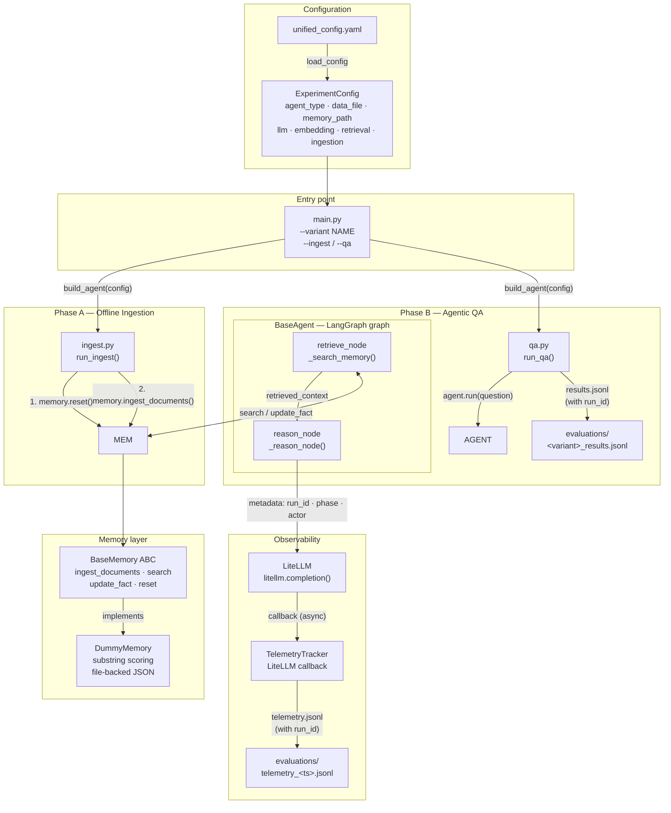
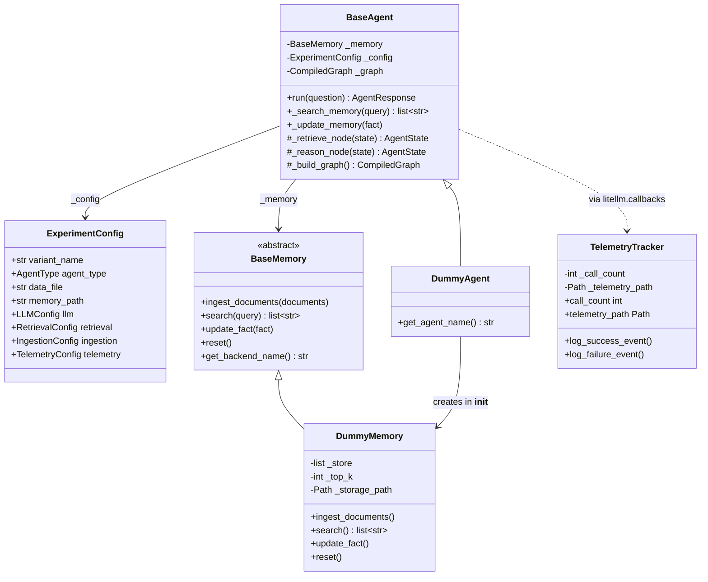

# AgenticMemoryProject

A scientific evaluation framework for measuring and optimizing **token efficiency** in autonomous AI agents. The project systematically compares memory architectures — Vector RAG, GraphRAG, and custom implementations — to quantify the tradeoff between ingestion cost and test-time token waste.

## The Core Problem

Standard Vector RAG agents suffer from **context poisoning**: retrieving large amounts of loosely-relevant text bloats the context window, burns tokens on every reasoning step, and degrades answer quality on multi-hop questions. This framework measures that problem precisely and tests whether alternative memory architectures can solve it.

---

## Architecture

The system has two strictly separated phases. Ingestion is offline and stateless. The agent only runs at test time and never re-ingests.



**Correlation:** every `agent.run()` generates a unique `run_id` that appears in both output files. Join them on `run_id` to tie token costs to individual questions.

---

## Project Structure

```
AgenticMemoryProject/
├── main.py                      # CLI entry point (--variant, --ingest, --qa)
├── src/
│   ├── config/
│   │   ├── unified_config.yaml  # Single source of truth for all experiment params
│   │   └── settings.py          # Pydantic models and load_config()
│   │
│   ├── memory/
│   │   ├── base.py              # BaseMemory ABC — the agent-facing contract
│   │   └── model_dummy.py       # DummyMemory — substring scoring, file-backed
│   │
│   ├── agent/
│   │   ├── base.py              # BaseAgent — concrete LangGraph graph + LiteLLM node
│   │   ├── agent_dummy.py       # DummyAgent — wires DummyMemory into BaseAgent
│   │   └── factory.py           # build_agent(config) — dispatches on agent_type
│   │
│   ├── pipelines/
│   │   ├── ingest.py            # run_ingest() — reset + ingest documents
│   │   └── qa.py                # run_qa() — run questions, write results JSONL
│   │
│   └── telemetry/
│       └── tracker.py           # TelemetryTracker — LiteLLM callback, JSONL output
│
├── data/
│   ├── raw/                     # Dataset files (documents + questions, JSON)
│   └── processed/               # Persisted memory stores (DummyMemory JSON, ChromaDB, etc.)
│
├── evaluations/                 # Pipeline outputs — never modified by src/ code
│   ├── telemetry_<ts>.jsonl     # One record per LLM call, keyed by run_id
│   └── <variant>_<ts>_results.jsonl  # One record per question, keyed by run_id
│
├── notebooks/                   # EDA and visualization — never imported by pipelines
└── tests/
    ├── unit/                    # No LLM calls, no network (default suite)
    └── integration/             # Requires live Ollama endpoint; marked @pytest.mark.integration
```

---

## Tech Stack

| Layer               | Library                                                | Role                                           |
| ------------------- | ------------------------------------------------------ | ---------------------------------------------- |
| Agent orchestration | [LangGraph](https://github.com/langchain-ai/langgraph) | State machine, graph nodes, reasoning loop     |
| LLM gateway         | [LiteLLM](https://github.com/BerriAI/litellm)          | Unified API for all LLM calls + token tracking |
| Config              | Pydantic + YAML                                        | Validated, reproducible experiment parameters  |
| Package management  | [uv](https://github.com/astral-sh/uv)                  | Fast dependency resolution                     |

---

## Setup

```bash
uv sync

# Run default test suite (no LLM required)
uv run pytest -v

# Run integration tests (requires running Ollama with gpt-oss:20b + nomic-embed-text)
uv run pytest -m integration -v
```

---

## Running the Pipeline

All pipeline steps go through `main.py`. Pass `--ingest`, `--qa`, or both.

```bash
# Step 1 — ingest documents into memory (reads from data/raw/<data_file>)
python main.py --variant baseline_dummy --ingest

# Step 2 — run Q&A, write results to evaluations/
python main.py --variant baseline_dummy --qa

# Both steps in sequence
python main.py --variant baseline_dummy --ingest --qa

# Custom paths
python main.py --variant baseline_dummy --ingest --qa \
    --data-dir data/raw \
    --output-dir evaluations
```

Output after `--qa`:

```
Results saved to: evaluations/baseline_dummy_20260324T190000Z_results.jsonl
```

Telemetry is written automatically to `evaluations/telemetry_<session_ts>.jsonl`.

---

## Configuration

All experiment parameters live in [`src/config/unified_config.yaml`](src/config/unified_config.yaml). A variant carries only overrides; the loader deep-merges with `default`.

```yaml
default:
  agent_type: "dummy" # "dummy" | "vector" | "graph"
  data_file: "baseline_dummy.json" # file under data/raw/
  llm:
    model: "ollama/gpt-oss:20b" # always "provider/model" format
    temperature: 0.0
    max_tokens: 2048
  retrieval:
    top_k: 5
  ingestion:
    chunk_size: 512
    chunk_overlap: 64

variants:
  baseline_dummy:
    agent_type: "dummy"
    data_file: "baseline_dummy.json"
    memory_path: "data/processed/baseline_dummy.json" # persist between ingest + qa
```

**Validation rules:**

- All model names must use `provider/model` format (e.g., `ollama/mixtral`). A bare name raises `ValidationError`.
- `chunk_overlap` must be strictly less than `chunk_size`.
- `agent_type` must be `"dummy"`, `"vector"`, or `"graph"`.

### Adding a new variant

Add a block under `variants:` and specify only what differs from `default`:

```yaml
variants:
  vector_small_chunks:
    agent_type: "vector"
    data_file: "full_benchmark.json"
    memory_path: "data/processed/vector_small.db"
    llm:
      model: "openai/gpt-4o-mini"
    ingestion:
      chunk_size: 256
      chunk_overlap: 32
```

Then run: `python main.py --variant vector_small_chunks --ingest --qa`

---

## How the Classes Interact



**Key design rules:**

- `BaseAgent` is fully concrete. Subclasses only change the **memory backend** (constructor) or the **system prompt** (`_SYSTEM_PROMPT` class attribute) or the **graph topology** (`_build_graph()` override).
- `build_agent(config)` in `factory.py` is the only place that maps `agent_type` → concrete agent class. Pipeline code never imports agent classes directly.
- `BaseMemory` is the only interface the agent ever touches. It has no knowledge of whether `_memory` is `DummyMemory`, `VectorMemory`, or `GraphMemory`.
- `reset()` must be called before every ingestion run to guarantee a clean baseline.

---

## Telemetry

Every LLM call is intercepted by `TelemetryTracker` (a LiteLLM `CustomLogger`) and appended to a JSONL file in `evaluations/`:

```json
{
  "event": "llm_call",
  "timestamp": "2026-03-24T19:02:48Z",
  "call_index": 3,
  "run_id": "a1b2c3d4",
  "phase": "agent_reasoning",
  "actor": "langgraph_node",
  "variant_name": "baseline_dummy",
  "model": "ollama/gpt-oss:20b",
  "prompt_tokens": 312,
  "completion_tokens": 48,
  "total_tokens": 360,
  "latency_ms": 843.2
}
```

**Required tags** — every LiteLLM call must supply both via the `metadata` argument:

| Tag     | Allowed values                                                                        |
| ------- | ------------------------------------------------------------------------------------- |
| `phase` | `ingest`, `retrieval_overhead`, `agent_reasoning`, `evaluation`                       |
| `actor` | `vector_embed`, `graph_extract`, `graph_cypher_gen`, `langgraph_node`, `llm_as_judge` |

Missing tags produce a `WARNING` log and `"UNTAGGED"` in the record, making them easy to find.

**`call_index`** is a per-session counter (1, 2, 3 …). It lets you sort records chronologically when timestamps are too close to distinguish, and quickly see how many LLM calls a single pipeline run made.

**`run_id`** is an 8-char hex identifier generated per `agent.run()` call. It appears in both the telemetry file and the QA results file, so you can join them:

```python
import json, pandas as pd

tel = pd.DataFrame(
    json.loads(l) for l in open("evaluations/telemetry_20260324T190248Z.jsonl")
)
res = pd.DataFrame(
    json.loads(l) for l in open("evaluations/baseline_dummy_20260324T190248Z_results.jsonl")
)
# token cost per question
merged = res.merge(tel[["run_id", "total_tokens", "latency_ms"]], on="run_id")
```

### Registering the tracker

Call `register_tracker()` once before any LLM call. `main.py` does this automatically.

```python
from src.telemetry.tracker import register_tracker
from pathlib import Path

tracker = register_tracker(
    log_level="INFO",
    output_dir=Path("evaluations"),   # telemetry JSONL written here
)
# tracker.telemetry_path  → Path to the session file
# tracker.call_count      → number of successful calls so far
```

---

## Memory Interface

All backends implement four methods. The agent calls `search` and `update_fact` only; the pipeline calls `reset` and `ingest_documents`.

```python
class BaseMemory(ABC):

    def ingest_documents(self, documents: list[str]) -> None:
        # Phase A — chunk, embed, persist. May call LLM (tag as "ingest").
        ...

    def search(self, query: str) -> list[str]:
        # Phase B — return plain strings, never backend objects.
        # Number of results bounded by config.retrieval.top_k.
        ...

    def update_fact(self, fact: str) -> None:
        # Phase B — must be immediately searchable after return.
        ...

    def reset(self) -> None:
        # Called before every ingest run to clear all persisted state.
        ...
```

### Adding a new memory backend

1. Create `src/memory/model_<name>.py`, subclass `BaseMemory`, implement all four methods.
2. Tag every internal LLM call with the correct `phase`/`actor` values.
3. Export from `src/memory/__init__.py`.
4. Add a branch to `src/agent/factory.py`:
   ```python
   if config.agent_type == "vector":
       from src.memory.model_vector import VectorMemory
       return VectorAgent(memory=VectorMemory(config), config=config)
   ```
5. Add unit tests in `tests/unit/test_<name>_memory.py` using `test_dummy_memory.py` as template.

---

## Design Principles

**Never hardcode model names.** Always pull from config. This ensures every run is reproducible and comparable.

**The agent is backend-agnostic.** Agent code imports `BaseMemory` only. It never imports `VectorMemory`, `GraphMemory`, or anything from LlamaIndex/ChromaDB/Neo4j directly.

**Tag every LLM call.** An untagged call is a token cost that cannot be attributed, making benchmarking data useless. The tracker warns on every untagged call.

**Phase A and Phase B are separate processes.** Ingestion runs once, offline. The agent must not trigger ingestion at test time — that would contaminate the token counts being measured.

**Reset before every ingest.** Call `memory.reset()` at the start of each ingestion run to guarantee that previous data from failed or partial runs does not pollute results.

**Return plain strings from `search()`.** Backend-specific objects (ChromaDB `Document`, embedding vectors, graph node IDs) must never cross the `BaseMemory` boundary into the agent.
